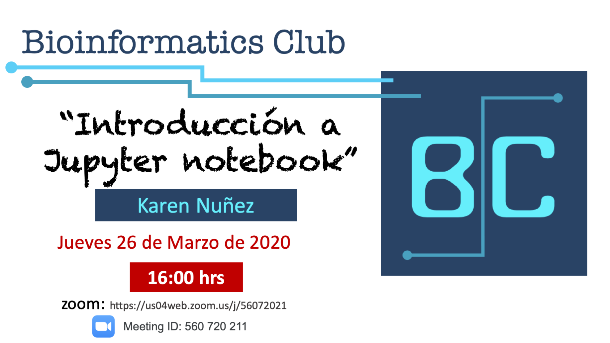
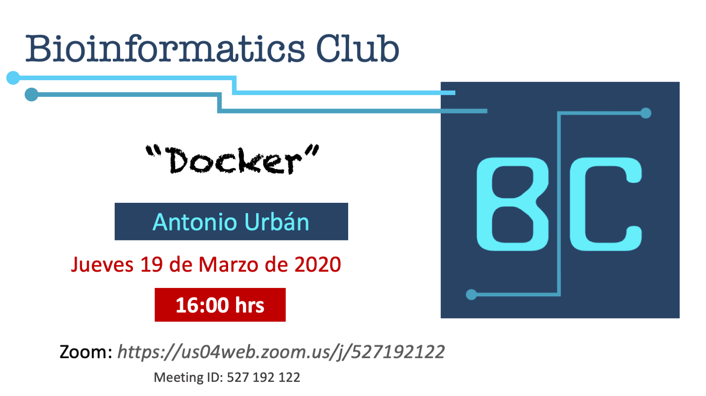
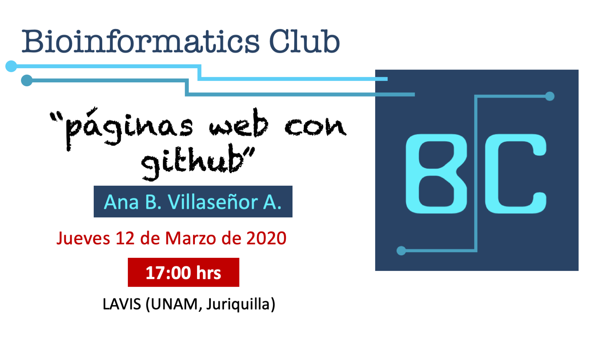

# {.tabset .tabset-fade .tabset-pills}
***

## Próximo evento

[](https://us04web.zoom.us/j/56072021)

```{r, out.width = "90%", echo = FALSE, fig.align = "center"}
#
```


## Sesiones pasadas 

[](slides/Docker.pdf)

[](slides/Paginas_web_Github.pdf)

[](https://github.com/mjeziorski/bioinformatics_club)

[](slides/awk.pdf)

[](slides/ggplot2Introduction.html)

Otras fechas pasadas de nuestras reuniones del BC: 

```{r, echo=FALSE,warning=FALSE}
library(knitr)
kable(read.csv("files/Reuniones.txt"))

```

