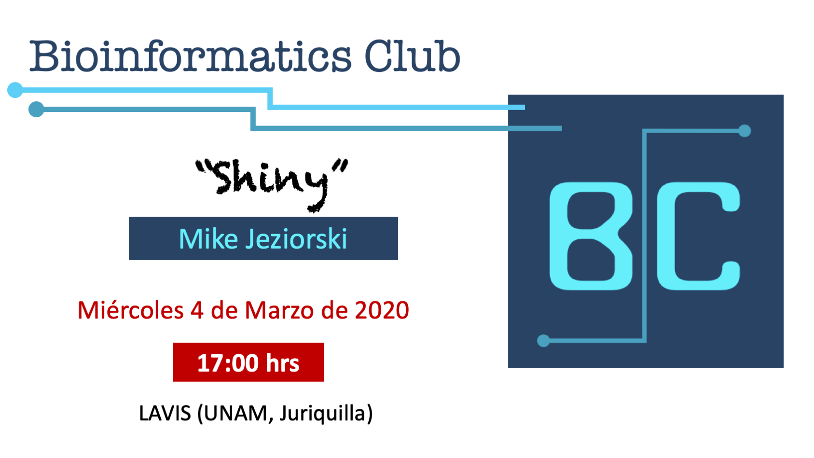
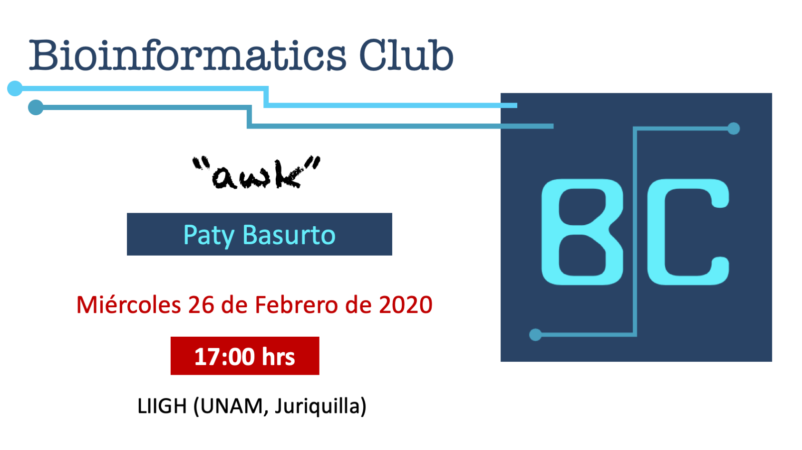
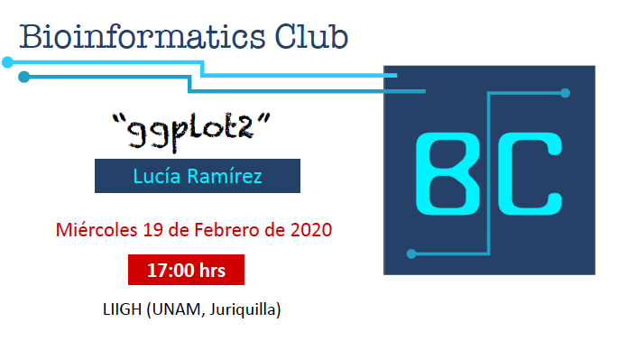

# {.tabset .tabset-fade .tabset-pills}
***

## Próximo evento

```{r, out.width = "90%", echo = FALSE, fig.align = "center"}

```


## Sesiones pasadas 

[](slides/awk.pdf)

[](slides/ggplot2Introduction.html)

Otras fechas pasadas de nuestras reuniones del BC: 

```{r, echo=FALSE,warning=FALSE}
library(knitr)
kable(read.csv("files/Reuniones.txt"))

```

